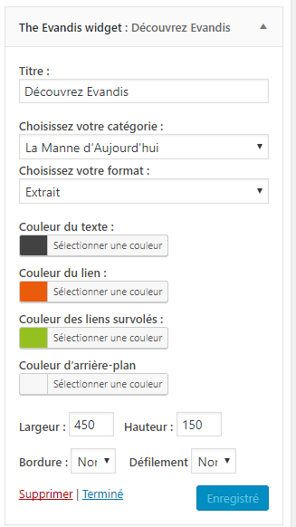
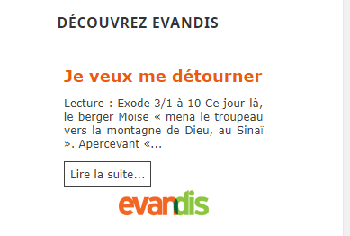

# Evandis Widget
Displays the Evandis texts in a widget.

## Installation
1. Upload the full directory into your '/wp-content/plugins' directory
2. Activate the plugin at the plugin administration page
3. Go to Appearance -> Widgets

### Some screenshots:

